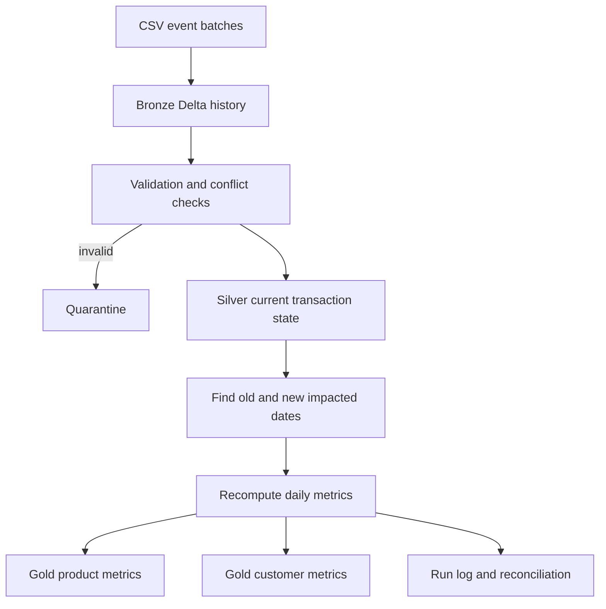

# Architecture

```mermaid
flowchart TD
  A[CSV event batches] --> B[Bronze Delta history]
  B --> C[Validation and conflict checks]
  C -->|invalid| Q[Quarantine]
  C --> D[Silver current transaction state]
  D --> E[Find old and new impacted dates]
  E --> F[Recompute daily metrics]
  F --> G[Gold product metrics]
  F --> H[Gold customer metrics]
  F --> I[Run log and reconciliation]
```

The pipeline is a local micro-batch architecture. A periodic producer can generate new CSV files, but a scheduler or streaming broker is not required by the challenge.
